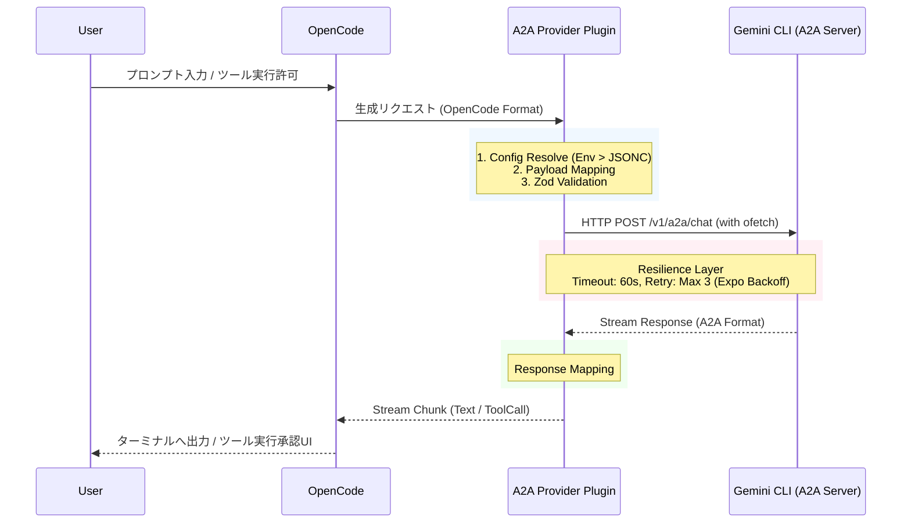

# OpenCode to Gemini CLI A2A Provider Plugin Specification

## 1. Project Overview

本プロジェクトは、ターミナルIDEエージェント「OpenCode」と「Gemini CLI」を、公式のA2A（Agent-to-Agent）プロトコルを介してローカルフェデレーションさせるためのカスタムプロバイダープラグイン（opencode-geminicli-a2a-provider）の開発を目的とする。

非公式プロキシの利用によるアカウントBAN等のリスクを排除し、堅牢かつセキュアなローカルプロセス間通信を実現する。

### 1.1 Scope

* OpenCodeのLLMリクエストをA2Aプロトコルに変換し、ローカルのGemini CLI（A2Aサーバー）へ送信する。
* Gemini CLIからのストリーミングレスポンスをOpenCode標準フォーマットに変換する。
* ツール（MCP）の実行要求を中継し、OpenCode側のネイティブなAsk/Allow（承認UI）へ委譲する。
* ネットワークエラーや無応答に対するリトライ・タイムアウト機構を内包する。

## 2. Tech Stack

本プラグインは、OpenCodeの最新版（v0.42.x以上）に互換性を持つよう設計する。

| Category | Technology / Library | Reason / Role |
| :--- | :--- | :--- |
| **Language** | TypeScript (ESNext) | 型安全性とモダンなJavaScript機能の利用 |
| **HTTP Client** | ofetch | 標準で自動リトライ、タイムアウト、ストリーム処理をサポートする堅牢なFetchラッパー |
| **Validation** | zod | A2Aサーバーとの通信境界におけるランタイムのペイロードスキーマ検証 |
| **Build Tool** | tsup または esbuild | 高速なバンドル処理。OpenCodeプラグイン用のCJS/ESM出力 |

## 3. Architecture

### 3.1 Directory Structure

opencode-geminicli-a2a-provider/  
├── package.json  
├── tsconfig.json  
├── src/  
│   ├── index.ts           # プラグインのエントリポイント  
│   ├── config.ts          # 設定読み込み・マージロジック  
│   ├── provider.ts        # OpenCodeのProviderインターフェース実装  
│   ├── a2a-client.ts      # ofetchを用いたGemini CLIとの通信クライアント  
│   ├── schemas.ts         # Zodによる型定義・バリデーションスキーマ  
│   └── utils/  
│       └── mapper.ts      # OpenCode形式 ↔ A2A形式のデータマッパー

### 3.2 Data Flow (Mermaid)



## 4. Features & Requirements

### 4.1 優先順位 (MoSCoW)

* **[Must Have]** 環境変数および設定ファイルからの接続情報ロード（環境変数を優先）。
* **[Must Have]** OpenCodeのメッセージ履歴からA2Aペイロードへのマッピング。
* **[Must Have]** ofetchを用いた、ストリーミング通信と自動リトライ（最大3回、60秒タイムアウト）。
* **[Must Have]** Gemini CLIからのツールコール要求をOpenCode標準のフォーマットへ渡し、実行を委譲。
* **[Should Have]** zodを用いたA2Aレスポンス（Chunk）のパースとスキーマ検証。
* **[Won't Have]** プラグイン独自でのコンテキスト刈り込み（プルーニング）機能。
* **[Won't Have]** プラグイン独自でのツール実行承認UIや自動許可フィルター。

### 4.2 Configuration Resolution

設定値は以下の優先順位で解決すること（1が最優先）。

1. **環境変数**: GEMINI_A2A_PORT, GEMINI_A2A_HOST, GEMINI_A2A_TOKEN
2. **OpenCode設定**: opencode.jsonc 内の a2aProvider オブジェクト
3. **デフォルト値**: Host: 127.0.0.1, Port: 41242, Token: undefined

## 5. Data Structure & Schemas (Zod / TypeScript)

通信境界を保護するため、src/schemas.ts にて以下のZodスキーマを定義する。

```typescript
import { z } from 'zod';

// 1. Configuration Schema  
export const ConfigSchema = z.object({  
  host: z.string().default('127.0.0.1'),  
  port: z.number().int().default(41242),  
  token: z.string().optional(),  
});  
export type A2AConfig = z.infer<typeof ConfigSchema>;

// 2. A2A Request Schema (to Gemini CLI)  
export const A2ARequestSchema = z.object({  
  model: z.string(),  
  messages: z.array(z.object({  
    role: z.enum(['user', 'assistant', 'system']),  
    content: z.string(),  
  })),  
  tools: z.array(z.any()).optional(), // OpenCode側のツール定義をパススルー  
  stream: z.literal(true),  
});  
export type A2ARequest = z.infer<typeof A2ARequestSchema>;

// 3. A2A Response Chunk Schema (from Gemini CLI)  
export const A2AResponseChunkSchema = z.object({  
  id: z.string(),  
  choices: z.array(z.object({  
    delta: z.object({  
      content: z.string().optional(),  
      tool_calls: z.array(z.any()).optional(),  
    }),  
    finish_reason: z.string().nullable(),  
  })),  
});  
export type A2AResponseChunk = z.infer<typeof A2AResponseChunkSchema>;
```

## 6. API Definition (Resilience Configuration)

ofetchのインスタンス生成時に、以下の設定を必ず適用すること。

* **Endpoint**: http://{host}:{port}/v1/a2a/chat
* **Headers**:
    * Content-Type: application/json
    * Authorization: Bearer {token} (tokenが存在する場合のみ)
* **Timeout**: 60000 (60秒)
* **Retry Options**:
    ```json
    {
      "retry": 3,
      "retryDelay": 500,
      "retryStatusCodes": [408, 429, 500, 502, 503, 504]
    }
    ```

## 7. LLM Guidelines (For AI Developer)

このドキュメントを読み込んだAIアシスタントへ：

1. **アーキテクチャの厳守**: このプラグインは純粋な「プロトコル変換器（Adapter）」です。OpenCodeのコンテキストを刈り込んだり、独自にツールを実行・承認したりするロジックは**絶対に実装しないでください**。すべてOpenCodeの標準APIに委譲してください。
2. **エラーハンドリング**: Gemini CLI（ローカルサーバー）は起動していない可能性があります。ofetchの接続エラー時には、OpenCode側にわかりやすいエラーメッセージ（例: Gemini CLI A2A server is not running on port 41242.）をスローしてください。
3. **ストリーム処理**: A2AプロトコルはSSE（Server-Sent Events）またはNDJSON（Newline Delimited JSON）でチャンクを返します。ofetchでストリームを正しく読み取り、A2AResponseChunkSchemaでsafeParseを行ってからOpenCodeのレスポンスジェネレータにyieldしてください。
