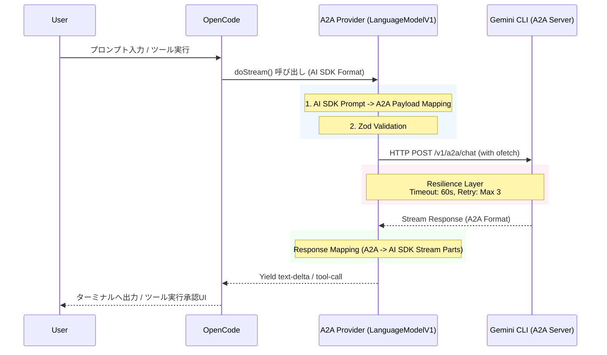

# OpenCode to Gemini CLI A2A Provider Plugin Specification

## 1. Project Overview

本プロジェクトは、ターミナルIDEエージェント「OpenCode」と「Gemini CLI」を、公式のA2A（Agent-to-Agent）プロトコルを介してローカルフェデレーションさせるためのカスタムプロバイダープラグイン（opencode-geminicli-a2a-provider）の開発を目的とする。

中間にOpenAI互換プロキシサーバーを立てるアプローチを排除し、OpenCodeのプラグインAPI（AI SDK互換）内で直接A2Aプロトコルへの変換を行うことで、遅延を最小化した堅牢なローカルプロセス間通信を実現する。

### 1.1 Scope

* OpenCode（Vercel AI SDK仕様）からのLLMリクエストを受け取り、A2Aプロトコルに変換してローカルのGemini CLI（A2Aサーバー）へ送信する。
* Gemini CLIからのストリーミングレスポンス（A2Aフォーマット）を、AI SDKが要求するストリーム形式に変換してOpenCodeへ返す。
* ツール（MCP）の実行要求を中継し、OpenCode側のネイティブなAsk/Allow（承認UI）へ委譲する。
* ネットワークエラーや無応答に対するリトライ・タイムアウト機構を内包する。

## 2. Tech Stack

本プラグインは、OpenCodeの最新版（v0.42.x以上）に互換性を持つよう設計する。

| Category | Technology / Library | Reason / Role |
| :--- | :--- | :--- |
| Language | TypeScript (ESNext) | 型安全性とモダンなJavaScript機能の利用 |
| Provider API | @ai-sdk/provider | OpenCodeが解釈できるカスタムプロバイダーインターフェース（LanguageModelV1等）の実装用 |
| HTTP Client | ofetch | 標準で自動リトライ、タイムアウト、ストリーム処理をサポートする堅牢なFetchラッパー |
| Validation | zod | A2Aサーバーとの通信境界におけるランタイムのペイロードスキーマ検証 |
| Build Tool | tsup または esbuild | 高速なバンドル処理。OpenCodeプラグイン用のCJS/ESM出力 |

## 3. Architecture

### 3.1 Directory Structure

```text
opencode-geminicli-a2a-provider/
├── package.json
├── tsconfig.json
├── src/
│   ├── index.ts           # プラグインのエントリポイント（Providerファクトリのエクスポート）
│   ├── config.ts          # 設定読み込み・マージロジック
│   ├── provider.ts        # @ai-sdk/provider (LanguageModelV1) の実装クラス
│   ├── a2a-client.ts      # ofetchを用いたGemini CLIとの通信クライアント
│   ├── schemas.ts         # Zodによる型定義・バリデーションスキーマ
│   └── utils/
│       └── mapper.ts      # AI SDK形式 ↔ A2A形式の双方向データマッパー
```

### 3.2 Data Flow (Mermaid)



## 4. Features & Requirements

### 4.1 優先順位 (MoSCoW)

* **[Must Have]** `@ai-sdk/provider` パッケージの `LanguageModelV1` インターフェース（またはOpenCode公式Provider API）への完全準拠。
* **[Must Have]** AI SDKフォーマットからA2Aペイロードへのマッピング（`mapper.ts`）。
* **[Must Have]** `ofetch`を用いた、ストリーミング通信と自動リトライ（最大3回、60秒タイムアウト）。再試行は「接続確立（初回ヘッダ/レスポンス受信）前」のみ許可対象とする。また、再試行を許すリクエストは必ず `idempotency key` を要求し、キーがない場合は再試行しないこと。
* **[Must Have]** Gemini CLIからのツールコール要求をAI SDKのツールコール形式へマッピングし、OpenCodeへ返却。
* **[Should Have]** `zod`を用いたA2Aレスポンス（Chunk）のパースとスキーマ検証。
* **[Won't Have]** 中間プロキシサーバー（Express/Hono等）の立ち上げ（直接プロバイダークラスとして動作させるため）。
* **[Won't Have]** プラグイン独自でのツール実行承認UIや自動許可フィルター。

### 4.2 Configuration Resolution

設定値は以下の優先順位で解決すること（1が最優先）。

1.  **環境変数**: `GEMINI_A2A_PORT`, `GEMINI_A2A_HOST`, `GEMINI_A2A_TOKEN`
2.  **OpenCode設定**: `opencode.jsonc` 内の `a2aProvider` オブジェクト
3.  **デフォルト値**: Host: `127.0.0.1`, Port: `41242`, Token: `undefined`

## 5. Data Structure & Schemas (Zod / TypeScript)

通信境界を保護するため、`src/schemas.ts` にて以下のZodスキーマを定義する。

```typescript
import { z } from 'zod';

// 1. Configuration Schema
export const ConfigSchema = z.object({
  host: z.string().default('127.0.0.1'),
  port: z.number().int().default(41242),
  token: z.string().optional(),
});

export type A2AConfig = z.infer<typeof ConfigSchema>;

// 2. A2A Request Schema (to Gemini CLI)
export const A2ARequestSchema = z.object({
  model: z.string(),
  messages: z.array(z.object({
    role: z.enum(['user', 'assistant', 'system']),
    content: z.string(),
  })),
  tools: z.array(z.object({
    type: z.string(),
    function: z.object({
      name: z.string(),
      description: z.string().optional(),
      parameters: z.unknown().optional(),
    }).passthrough().optional(),
  }).passthrough()).optional(),
  stream: z.literal(true),
});

export type A2ARequest = z.infer<typeof A2ARequestSchema>;

// 3. A2A Response Chunk Schema (from Gemini CLI)
export const A2AResponseChunkSchema = z.object({
  id: z.string(),
  choices: z.array(z.object({
    delta: z.object({
      content: z.string().optional(),
      tool_calls: z.array(z.object({
        id: z.string().optional(),
        type: z.string().optional(),
        function: z.object({
          name: z.string().optional(),
          arguments: z.string().optional(),
        }).passthrough().optional(),
      }).passthrough()).optional(),
    }),
    finish_reason: z.string().nullable(),
  })),
});

export type A2AResponseChunk = z.infer<typeof A2AResponseChunkSchema>;
```

## 6. API Definition (Resilience Configuration)

`ofetch`のインスタンス生成時に、以下の設定を必ず適用すること。

* **Endpoint**: `http://{host}:{port}/v1/a2a/chat`
* **Headers**:
    * `Content-Type: application/json`
    * `Authorization: Bearer {token}` (tokenが存在する場合のみ)
* **Timeout**: `60000` (60秒)
* **Retry Options**:
    ```json
    {
      "retry": 3,
      "retryDelay": 500,
      "retryStatusCodes": [408, 429, 500, 502, 503, 504]
    }
    ```

## 7. LLM Guidelines (For AI Developer)

このドキュメントを読み込んだAIアシスタントへ：

* **実装の最初のステップ**: まず `@opencode-ai/plugin` および `@ai-sdk/provider` の型定義を調査してください。OpenCodeがカスタムプロバイダーとして要求するインターフェース（例: Vercel AI SDK の `LanguageModelV1` クラスの `doStream` メソッドの実装）を特定することが最優先事項です。
* **アンチパターン**: 調査の結果、OpenCodeのAPIが不明瞭だったとしても、「ローカルにExpressサーバーを立てて `@ai-sdk/openai-compatible` を使うアプローチ」に逃げないでください。本プロジェクトの目的は、A2Aプロトコルをネイティブに喋るカスタムプロバイダークラス（TSプラグイン）を作ることです。
* **エラーハンドリング**: Gemini CLI（ローカルサーバー）は起動していない可能性があります。`ofetch`の接続エラー時には、OpenCode（AI SDK）が想定するエラークラスをスローするか、わかりやすいエラーメッセージを伝播させてください。
