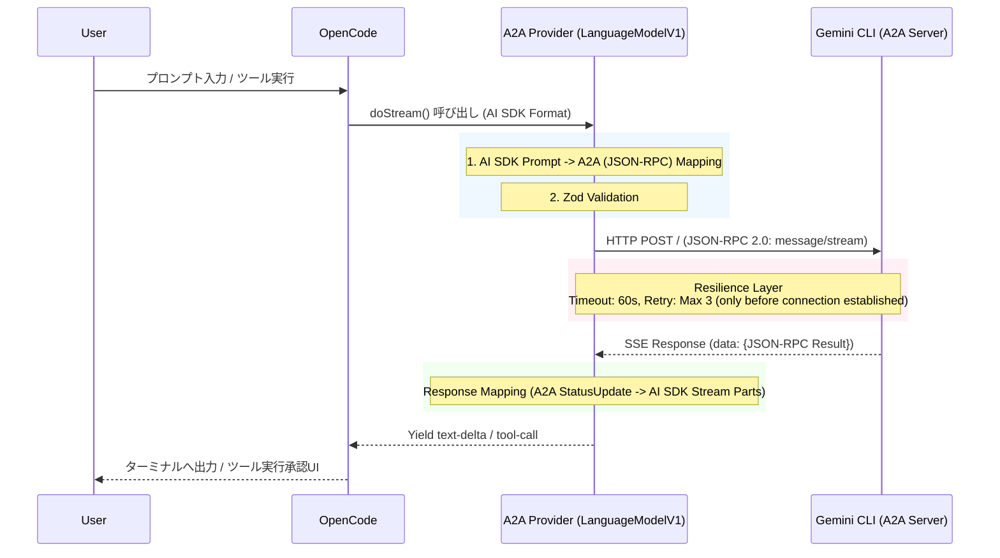

# OpenCode to Gemini CLI A2A Provider Plugin Specification

## 1. Project Overview

本プロジェクトは、ターミナルIDEエージェント「OpenCode」と「Gemini CLI」を、公式のA2A（Agent-to-Agent）プロトコルを介してローカルフェデレーションさせるためのカスタムプロバイダープラグイン（opencode-geminicli-a2a-provider）の開発を目的とする。

中間にOpenAI互換プロキシサーバーを立てるアプローチを排除し、OpenCodeのプラグインAPI（AI SDK互換）内で直接A2Aプロトコルへの変換を行うことで、遅延を最小化した堅牢なローカルプロセス間通信を実現する。

### 1.1 Scope

* OpenCode（Vercel AI SDK仕様）からのLLMリクエストを受け取り、A2Aプロトコルに変換してローカルのGemini CLI（A2Aサーバー）へ送信する。
* Gemini CLIからのストリーミングレスポンス（A2Aフォーマット）を、AI SDKが要求するストリーム形式に変換してOpenCodeへ返す。
* ツール（MCP）の実行要求を中継し、OpenCode側のネイティブなAsk/Allow（承認UI）へ委譲する。
* ネットワークエラーや無応答に対するリトライ・タイムアウト機構を内包する。

## 2. Tech Stack

本プラグインは、OpenCodeの最新版（v0.42.x以上）に互換性を持つよう設計する。

| Category | Technology / Library | Reason / Role |
| :--- | :--- | :--- |
| Language | TypeScript (ESNext) | 型安全性とモダンなJavaScript機能の利用 |
| Provider API | @ai-sdk/provider | OpenCodeが解釈できるカスタムプロバイダーインターフェース（LanguageModelV1等）の実装用 |
| HTTP Client | ofetch | 標準で自動リトライ、タイムアウト、ストリーム処理をサポートする堅牢なFetchラッパー |
| Validation | zod | A2Aサーバーとの通信境界におけるランタイムのペイロードスキーマ検証 |
| Build Tool | tsup または esbuild | 高速なバンドル処理。OpenCodeプラグイン用のCJS/ESM出力 |

## 3. Architecture

### 3.1 Directory Structure

```text
opencode-geminicli-a2a-provider/
├── package.json
├── tsconfig.json
├── src/
│   ├── index.ts           # プラグインのエントリポイント（Providerファクトリのエクスポート）
│   ├── config.ts          # 設定読み込み・マージロジック
│   ├── provider.ts        # @ai-sdk/provider (LanguageModelV1) の実装クラス
│   ├── a2a-client.ts      # ofetchを用いたGemini CLIとの通信クライアント
│   ├── schemas.ts         # Zodによる型定義・バリデーションスキーマ
│   └── utils/
│       └── mapper.ts      # AI SDK形式 ↔ A2A形式の双方向データマッパー
```

### 3.2 Data Flow (Mermaid)



## 4. Features & Requirements

### 4.1 優先順位 (MoSCoW)

* **[Must Have]** `@ai-sdk/provider` パッケージの `LanguageModelV1` インターフェースへの完全準拠。
* **[Must Have]** AI SDKフォーマットから A2A (JSON-RPC 2.0) ペイロードへのマッピング (`mapper.ts`)。
* **[Must Have]** `ofetch` を用いた、SSE形式のストリーミング通信。
* **[Must Have]** Gemini CLI からの `status-update` イベント内の `message.parts` を解析し、AI SDK のストリーム形式へ変換。
* **[Should Have]** `zod` を用いた A2A JSON-RPC レスポンスのバリデーション。
* **[Won't Have]** OpenAI 互換 API エンドポイントの実装。

### 4.2 Configuration Resolution

設定値は以下の優先順位で解決すること（1が最優先）。

1.  **環境変数**: `GEMINI_A2A_PORT`, `GEMINI_A2A_HOST`, `GEMINI_A2A_TOKEN`
2.  **OpenCode設定**: `opencode.jsonc` 内の `a2aProvider` オブジェクト
3.  **デフォルト値**: Host: `127.0.0.1`, Port: `41242`, Token: `undefined`

## 5. Data Structure & Schemas (Zod / TypeScript)

`src/schemas.ts` にて以下の JSON-RPC 準拠スキーマを定義する。

```typescript
import { z } from 'zod';

// 1. Configuration Schema (Stable)
export const ConfigSchema = z.object({
  host: z.string().default('127.0.0.1'),
  port: z.number().int().default(41242),
  token: z.string().optional(),
  protocol: z.enum(['http', 'https']).default('http'),
});

// 2. A2A JSON-RPC Request Schema
export const A2AJsonRpcRequestSchema = z.object({
  jsonrpc: z.literal('2.0'),
  id: z.union([z.string(), z.number()]),
  method: z.literal('message/stream'),
  params: z.object({
    message: z.object({
      messageId: z.string(),
      role: z.enum(['user', 'assistant']), // 注: 'system' ロールは変換時に 'user' のメッセージ内容へ統合される（例: role: 'system' -> contentをuser同等として送信）
      parts: z.array(z.object({
        kind: z.literal('text'),
        text: z.string()
      }))
    }),
    configuration: z.object({
      blocking: z.boolean().default(false)
    }).optional()
  })
});

// 3. A2A JSON-RPC Response (SSE data: ...)
export const A2AResponseResultSchema = z.discriminatedUnion('kind', [
  z.object({
    kind: z.literal('task'),
    id: z.string(),
    contextId: z.string(),
    status: z.object({ state: z.enum(['working', 'stop', 'error']) })
  }),
  z.object({
    kind: z.literal('status-update'),
    taskId: z.string(),
    status: z.object({
      state: z.enum(['working', 'stop', 'error']),
      message: z.object({
        parts: z.array(z.object({
          kind: z.string(),
          text: z.string().optional(),
          data: z.unknown().optional()
        }))
      }).optional()
    }),
    final: z.boolean().optional()
  })
]);

export const ResultResponseSchema = z.object({
  jsonrpc: z.literal('2.0'),
  id: z.union([z.string(), z.number()]),
  result: A2AResponseResultSchema,
});

export const ErrorResponseSchema = z.object({
  jsonrpc: z.literal('2.0'),
  id: z.union([z.string(), z.number()]).nullable(),
  error: z.object({
    code: z.number(),
    message: z.string()
  })
});

export const A2AJsonRpcResponseSchema = z.union([ResultResponseSchema, ErrorResponseSchema]);
```

## 6. API Definition (Resilience Configuration)

* **Endpoint**: `http://{host}:{port}/`
* **Protocol**: JSON-RPC 2.0 over HTTP (Streaming via SSE)
* **Status Handling**:
    * `status.state === 'working'` かつ `status.message.parts` 内の `text` を `text-delta` として扱う。
    * `final === true` をストリームの終了トリガーとして扱う。

## 7. LLM Guidelines (For AI Developer)

このドキュメントを読み込んだAIアシスタントへ：

* **実装の最初のステップ**: まず `@opencode-ai/plugin` および `@ai-sdk/provider` を参照し、それらが提供する型インターフェース定義を調査してください。OpenCodeがカスタムプロバイダーとして要求する仕様（例: Vercel AI SDK の公式定義に準拠した `LanguageModelV1` インターフェースの `doGenerate` と `doStream` メソッドの実装）を特定することが最優先事項です。
* **アンチパターン**: 調査の結果、OpenCodeのAPIが不明瞭だったとしても、「ローカルにExpressサーバーを立てて `@ai-sdk/openai-compatible` を使うアプローチ」に逃げないでください。本プロジェクトの目的は、A2Aプロトコルをネイティブに喋るカスタムプロバイダークラス（TSプラグイン）を作ることです。
* **エラーハンドリング**: Gemini CLI（ローカルサーバー）は起動していない可能性があります。`a2a-client.ts` における `ofetch` 呼び出し箇所、および初期化部分において、発生したエラーに応じて以下のように具体的なエラー型を明示して伝播させてください：
    * ネットワークエラー、タイムアウト、接続拒否などの `ofetch` 接続エラー時は、OpenCode が提供する `APICallError` などをスローし、内部に原始エラーメッセージ、HTTPステータス、URLを保持させること。
    * レスポンスの構造が想定外の場合（Zodスキーマ検証エラー等）は、`InvalidResponseDataError` などをスローし、レスポンスボディの抜粋など詳細な情報を含めること。
